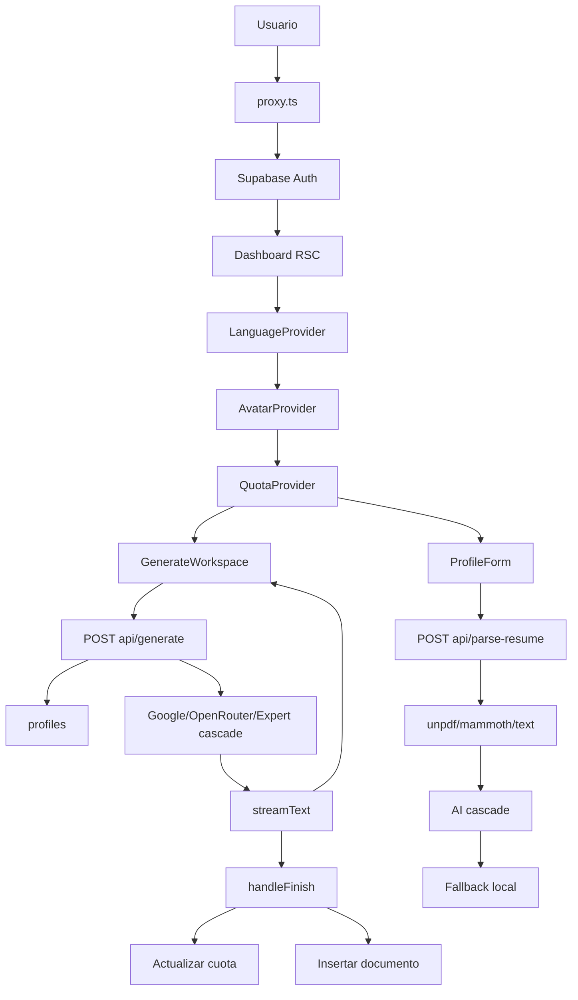

Haré una auditoría estrictamente de solo lectura: primero inventariaré la estructura y toda la documentación Markdown, después contrastaré roadmap, arquitectura y auditoría previa contra código, rutas, APIs, configuración y tests. No modificaré archivos ni ejecutaré migraciones.

Ya confirmé que es una única aplicación y localicé siete documentos Markdown, incluido `AUDIT_REPORT.md`. Ahora leeré primero toda esa documentación y, en paralelo, los manifiestos/configuraciones que definen el stack; después usaré sus afirmaciones como una lista de comprobación contra la implementación real.

La primera discrepancia importante ya aparece en la configuración: la documentación y la auditoría llaman al proyecto “Next.js 15.3”, pero `package.json` instala **Next.js 16.3.1**; también sigue instalada `html2pdf.js` aunque los documentos afirman que fue reemplazada. Continuaré con un inventario exhaustivo de código y activos para verificar cada fase y detectar elementos no documentados.

Dividiré la revisión en tres áreas independientes para cubrir todo sin perder profundidad: backend/seguridad y persistencia; frontend/flujos de usuario; y una verificación específica de las afirmaciones del reporte existente, dependencias y configuración. Todas serán inspecciones de solo lectura con evidencia por archivo y línea.

Las revisiones independientes coinciden en que el reporte previo sobreestima el grado de terminación y, además, está desactualizado frente al propio repositorio. Verificaré ahora directamente los hallazgos de mayor impacto —cascada, cuotas, secretos, persistencia, autenticación e idiomas— y consultaré los diagnósticos actuales antes de redactar el informe final.

Los diagnósticos actuales confirman exactamente **31 errores** (además de numerosas advertencias), pero varias causas y ubicaciones del reporte ya no coinciden. Antes de cerrar, revisaré el segundo endpoint de IA, el catálogo de modelos y los estados cliente que pueden desalinear idiomas, cuota y modelo mostrado.

El código confirma que la “Phase 7” está solo nominalmente aplicada: el orden de modelos existe, pero la prioridad BYOK sigue invertida en modos estándar y el short-circuit no sabe qué proveedor falló. Haré una comprobación externa puntual de los IDs de OpenRouter, ya que el reporte los declara “verificados” sin dejar evidencia reproducible en el repositorio.

La verificación externa confirma varios IDs concretos, pero también añade un riesgo crítico que el reporte omite: los endpoints gratuitos de OpenRouter advierten que prompts/outputs pueden registrarse o usarse para mejora, mientras Vellura envía CVs y descripciones laborales sin una capa visible de consentimiento o clasificación de datos. Revisaré los últimos flujos de onboarding, settings e historial para completar la matriz de tareas y dependencias.

# Auditoría técnica de Vellura

## Alcance y método

Se inspeccionaron en modo de **solo lectura**:

- Todos los documentos `.md`.
- Estructura de `app/`, `components/`, `utils/`, `lib/`, `public/` y configuración.
- Route Handlers, Server Actions, providers, componentes cliente y rutas RSC.
- Dependencias, imports, referencias, assets, tests, schema y CI.
- Diagnósticos actuales del editor.
- Algunos IDs críticos de OpenRouter contra sus páginas oficiales.

Se excluyó del análisis línea por línea el código generado o de terceros de `.next/` y `node_modules/`.

**No se modificó ningún archivo, no se ejecutaron migraciones, builds ni refactors.**

---

# A. Resumen ejecutivo

## Veredicto real

Vellura es una **beta funcional avanzada**, pero **no está lista para producción**.

Los flujos principales existen:

- Autenticación.
- Perfil y currículum maestro.
- Generación de cartas con streaming.
- Selección de modelos.
- BYOK.
- Historial.
- PDF.
- Parsing de CV.
- Interfaz en cuatro idiomas.

Sin embargo, el informe existente describe el proyecto como:

> “feature-complete, production-ready”

Esta conclusión de `AUDIT_REPORT.md:9-30` **no está respaldada por el estado real del repositorio**.

### Estado estimado

| Área | Estado |
|---|---|
| Producto y UI principal | Avanzado |
| Generación IA | Parcial y con riesgos de fiabilidad |
| Autenticación | Funcional, con flujos incompletos |
| Persistencia | Funcional, pero no transaccional |
| Seguridad | No apta para producción |
| Privacidad | Riesgo crítico no contemplado |
| Cuotas/monetización | Implementación vulnerable a concurrencia |
| i18n | Amplia, pero inconsistente |
| Accesibilidad | Insuficiente |
| Reproducibilidad de base de datos | Ausente |
| Tests | Ausentes |
| CI/CD y monitorización | Ausentes |
| Calidad estática | 31 errores confirmados |

## Bloqueos principales de producción

1. **Las claves BYOK se almacenan en JSON plano y se serializan al navegador.**
2. **CVs y datos laborales pueden enviarse a endpoints gratuitos que registran o reutilizan datos.**
3. **El backend confía en `expertProviderId` y `expertModelId` enviados por el cliente.**
4. **Cuota y documento se actualizan por separado, sin transacción ni operación atómica.**
5. **El timeout de 4,5 segundos puede abortar generaciones activas.**
6. **El short-circuit de OpenRouter puede atribuir errores de Google a OpenRouter.**
7. **El modelo mostrado al usuario no necesariamente es el modelo utilizado.**
8. **No hay schema SQL versionado, por lo que RLS y estructura desplegada no pueden verificarse.**
9. **No hay rate limiting, tests, CI ni observabilidad.**
10. **Existen 31 errores estáticos confirmados.**

---

# B. Arquitectura actual detectada

## Stack real

| Capa | Implementación real |
|---|---|
| Framework | **Next.js 16.3.1**, App Router |
| UI runtime | React 19.2.8 |
| Lenguaje | TypeScript 5, `strict: true` |
| Estilos | Tailwind CSS 4 |
| Componentes | shadcn generado sobre **Base UI**, no Radix |
| Auth/DB | Supabase SSR + Supabase JS |
| IA | Vercel AI SDK 7 |
| Providers | Google, OpenAI, Anthropic, DeepSeek y OpenRouter |
| Streaming cliente | `useCompletion` de `@ai-sdk/react` |
| Streaming servidor | `streamText` y `ReadableStream` personalizado |
| PDF | `jspdf` |
| Markdown | `react-markdown`, sin `remark-gfm` |
| Parsing | `unpdf`, `mammoth` y fallback local |
| i18n | Context provider y diccionarios propios |
| Motion/toasts | Framer Motion y Sonner |

Evidencia: `package.json:12-49`, `tsconfig.json:1-33`.

### Discrepancias del stack documentado

- La documentación indica Next.js 15.3, pero el código usa **16.3.1**.
- La documentación indica Radix, pero los componentes usan `@base-ui/react`.
- La documentación dice `remark-gfm`, pero no está instalado ni configurado.
- `html2pdf.js` supuestamente fue reemplazado, pero sigue instalado sin uso.
- Algunas dependencias del AI SDK exigen Node moderno, pero no hay `engines`, `.nvmrc` ni `.node-version`.

## Puntos de entrada

| Ruta | Implementación |
|---|---|
| `/` | Redirige siempre a `/login` |
| `/login` | Login, registro, Google OAuth y solicitud de recuperación |
| `/auth/callback` | Intercambio de código Supabase |
| `/dashboard` | Onboarding y generador |
| `/dashboard/history` | Historial |
| `/dashboard/settings` | Perfil, seguridad y BYOK |
| `POST /api/generate` | Generación IA con streaming |
| `POST /api/parse-resume` | Parsing y estructuración de CV |
| `proxy.ts` | Actualización de sesión y protección del dashboard |

No existen:

- `/register`
- `/dashboard/generate`
- `/reset-password`

Las funcionalidades equivalentes están parcialmente integradas en otras rutas.

## Flujo real



## Base de datos inferida

El código presupone:

- `profiles`
- `documents`

Pero no existe:

- `supabase/schema.sql`
- Migraciones.
- Tipos generados.
- Triggers versionados.
- Políticas RLS versionadas.

Por ello, las afirmaciones de RLS habilitado y schema seguro son **no verificables desde el repositorio**.

---

# C. Funcionalidades completadas

“Completada” aquí significa que la conexión principal existe estáticamente; no implica certificación mediante pruebas E2E.

| Funcionalidad | Evidencia |
|---|---|
| Login por email y contraseña | `app/actions/auth.ts:8-31` |
| Registro dentro de `/login` | `app/actions/auth.ts:33-81` |
| Google OAuth | `app/actions/auth.ts:157-181` |
| Logout | `app/actions/auth.ts:184-188` |
| Protección de dashboard | `utils/supabase/middleware.ts:34-67` |
| Dashboard y topbar | `app/dashboard/layout.tsx:10-56` |
| Edición de currículum maestro | `components/dashboard/ProfileForm.tsx:115-128` |
| Upload PDF/DOCX/TXT/MD | `app/api/parse-resume/route.ts:141-190` |
| Extracción local de PDF/DOCX | `app/api/parse-resume/route.ts:159-184` |
| Fallback local de CV | `app/api/parse-resume/route.ts:404-424` |
| Prompt con resume y vacante | `app/api/generate/route.ts:94-114` |
| Streaming cliente-servidor | `GenerateWorkspace.tsx:115-160`, `api/generate/route.ts:263-369` |
| Tonos predefinidos | `GenerateWorkspace.tsx:351-369` |
| Historial persistente | `app/actions/documents.ts:6-26` |
| Búsqueda y filtros | `HistoryList.tsx:124-164` |
| Paginación | `HistoryList.tsx:166-189`, `HistoryList.tsx:618-695` |
| Borrado con confirmación | `HistoryList.tsx:245-261`, `documents.ts:29-50` |
| Copy con check temporal | `GenerateWorkspace.tsx:204-210`, `HistoryList.tsx:191-198` |
| PDF básico con jsPDF | `GenerateWorkspace.tsx:212-259`, `HistoryList.tsx:200-243` |
| Diccionarios EN/ES/FR/PT | `utils/i18n/dictionaries.ts` |
| Modo oscuro y paleta | `app/layout.tsx:54-64`, `tailwind.config.ts:9-16` |
| Límite base de 5/día | `utils/limits.ts:1-22` |
| Catálogo de modelos | `utils/ai-models.ts:280-524` |
| CRUD mult proveedor de BYOK | `app/actions/profile.ts:112-160` |

## Implementadas pero insuficientemente documentadas

- Google OAuth.
- Gestión de métodos de acceso.
- Cambio/establecimiento de contraseña desde Settings.
- Borrado de documentos.
- Estadísticas del historial.
- Selector de tamaño de página.
- Directivas personalizadas y temperatura en modo experto.
- Traducción automática durante parsing.
- Fallback local sin IA para CV.
- Editores expandidos de CV y descripción laboral.
- Reapertura manual del onboarding.
- Indicador de completitud del perfil.

---

# D. Funcionalidades parcialmente implementadas

| Funcionalidad | Estado real |
|---|---|
| Generación IA | Existe, pero el timeout, la cascada y la persistencia comprometen su fiabilidad |
| Streaming | Funciona en arquitectura, pero `AbortSignal.timeout(4500)` puede cortar el stream |
| Speed/Reasoning | El backend usa Gemini/Gemma primero; la UI muestra Nemotron como modelo activo |
| Cascade OpenRouter | Orden implementado, detección de proveedor defectuosa |
| Cuota diaria | Calculada, pero no atómica ni transaccional |
| BYOK | Funcional, pero inseguro y con prioridad incorrecta |
| Expert Mode | UI completa, backend sin allowlist robusta |
| Onboarding | Cuatro pasos, pero puede mostrar éxito aunque falle Supabase |
| i18n | Cuatro diccionarios, con textos hardcodeados y persistencia inconsistente |
| Avatar cloud | Guarda Base64 en `profiles`, no en Supabase Storage |
| Password reset | Enlace funcional hacia Settings, pero sin flujo específico de recovery |
| Email verification | Pantalla básica, sin resend ni estado completo |
| Markdown | Render básico, sin GFM y posiblemente sin estilos `prose` efectivos |
| Settings Tabs | Visualmente existen, pero son botones propios sin semántica Tabs |
| SEO | Metadata existe, pero apunta a un asset inexistente |
| Mobile | Layout parcialmente responsive, pero topbar y onboarding presentan riesgos |
| Sesión expirada | Maneja JWT inválido; no hay timeout real por inactividad |

---

# E. Funcionalidades pendientes

## Producto

- Modal de upgrade Pro.
- Resolver si deben existir rutas dedicadas `/register` y `/dashboard/generate`.
- Flujo explícito de recuperación de contraseña.
- Reenvío de email de verificación.
- Sincronización consistente de idiomas entre DB, cookies y localStorage.
- Mostrar el modelo realmente utilizado.
- Reset visual de cuota al cruzar medianoche.

## Plataforma

- Schema SQL reproducible.
- Políticas RLS versionadas.
- Operación atómica para cuota y documento.
- Rate limiting.
- Validación de requests.
- Límites de longitud para prompts y directivas.
- Cifrado de BYOK.
- Gestión adecuada de secretos.
- Consentimiento y política de tratamiento de datos para providers externos.
- Error boundaries.
- Loading boundaries.
- CI/CD.
- Monitorización y trazabilidad.
- Tests unitarios, integración y E2E.

## Calidad

- Resolver 31 errores.
- Corregir hooks.
- Corregir fallos de React Compiler.
- Eliminar `any`.
- Extraer utilidad PDF.
- Eliminar dependencias y componentes muertos.
- Unificar parsing de `byok_key`.
- Separar servicios de rutas y componentes.
- Actualizar documentación.

---

# F. Problemas, bugs y riesgos

## Críticos

### 1. Claves BYOK expuestas al cliente

Las keys completas se leen en el Server Component y se pasan a un Client Component:

- `app/dashboard/settings/page.tsx:17-29`
- `app/dashboard/settings/page.tsx:49-55`
- `components/dashboard/AdvancedBYOKForm.tsx:12-15`

Aunque visualmente se muestren como puntos, quedan serializadas en el payload RSC y en memoria del navegador.

Además, se guardan como JSON plano:

- `app/actions/profile.ts:130-154`

La UI afirma que se almacenan cifradas:

- `ModelSelectionDrawer.tsx:528-531`
- `AdvancedBYOKForm.tsx:167-175`

Esto es técnica y legalmente engañoso.

### 2. Privacidad de CVs en modelos gratuitos

`api/generate` incluye el currículum completo en el prompt y `api/parse-resume` puede enviar el CV a OpenRouter:

- `app/api/generate/route.ts:94-114`
- `app/api/parse-resume/route.ts:355-402`

Las páginas oficiales de algunos endpoints gratuitos indican que inputs/outputs pueden registrarse o usarse para mejora:

- [Nemotron 3.5 Lightning](https://openrouter.ai/nvidia/nemotron-3.5-lightning:free)
- [Nemotron 3 Ultra](https://openrouter.ai/nvidia/nemotron-3-ultra-550b-a55b:free)
- [Inkling](https://openrouter.ai/thinkingmachines/inkling:free)
- [Laguna XS 2.1](https://openrouter.ai/poolside/laguna-xs-2.1:free)

No se detectó consentimiento específico, clasificación de datos ni política de providers antes de enviar información profesional/personal.

### 3. Posible abuso de claves del sistema

El backend acepta directamente:

- `expertProviderId`
- `expertModelId`
- `temperature`
- `customDirectives`

`resolveAIModel` puede usar una key del sistema cuando no existe una del usuario:

- `utils/ai-providers.ts:44-122`

No hay allowlist estricta en el endpoint. Un usuario autenticado podría construir una petición directa con modelos no previstos o costosos.

### 4. Cuota y persistencia no transaccionales

La cuota se decrementa y el documento se inserta mediante operaciones independientes:

- `app/api/generate/route.ts:153-179`

Consecuencias posibles:

- Descontar cuota sin guardar documento.
- Guardar documento sin descontar.
- Varias peticiones simultáneas leyendo el mismo valor.
- Más generaciones diarias de las permitidas.

## Altos

### 5. Timeout de generación demasiado agresivo

```ts
abortSignal: AbortSignal.timeout(4500)
```

`app/api/generate/route.ts:273-286`

La señal se entrega a la operación completa. No es únicamente un timeout para recibir el primer chunk; puede permanecer vinculada a la generación y abortar streams válidos.

### 6. Short-circuit de OpenRouter defectuoso

```ts
const isOpenRouter429 =
  status === 429 && openrouterKey !== undefined;
```

`app/api/generate/route.ts:321-345`

El código comprueba si existe una key OpenRouter, no si el modelo que falló pertenece a OpenRouter. Un 429 de Google puede convertirse en “cuota OpenRouter agotada”.

Además, Google directo y OpenRouter comparten `modelName: "gemma-4-31b-it"`, lo que vuelve ambiguo el salto al siguiente candidato.

### 7. Prioridad Google BYOK no corregida

El reporte afirma que la key del usuario tiene prioridad en todos los modos. En la ruta principal ocurre lo contrario:

```ts
apiKey:
  process.env.GOOGLE_GENERATIVE_AI_API_KEY ||
  userKeys.google
```

`app/api/generate/route.ts:204-206`

En `resolveAIModel` y `parse-resume` sí se usa primero la key del usuario. La implementación sigue siendo inconsistente.

### 8. Modelo mostrado diferente del utilizado

La UI muestra:

- Nemotron 3.5 Lightning para Speed.
- Nemotron 3 Ultra para Reasoning.

`GenerateWorkspace.tsx:298-304`

Pero el backend intenta primero:

- Gemini 3.7 Flash.
- Gemma 4 31B.

`app/api/generate/route.ts:210-240`

El servidor devuelve `X-AI-Model`, pero el cliente no consume ese header:

- `app/api/generate/route.ts:362-368`

### 9. Sin rate limiting

No hay protección en:

- `/api/generate`
- `/api/parse-resume`

El parsing de CV tampoco consume cuota, por lo que puede provocar múltiples intentos contra siete modelos por petición.

### 10. Logs sensibles

Se registra:

- El body de generación.
- Los primeros 12 caracteres de la key OpenRouter.

`app/api/generate/route.ts:26-28`, `app/api/generate/route.ts:187-200`.

### 11. Onboarding con falsos positivos

`handleComplete` ignora los objetos `{ error }` devueltos por las Server Actions:

- `OnboardingWizard.tsx:167-197`

Puede guardar `localStorage`, cerrar el wizard y mostrar éxito aunque la escritura en Supabase haya fallado.

### 12. RLS no verificable

No hay schema, migraciones ni políticas en el repositorio. No puede certificarse:

- Creación automática de perfiles.
- Defaults.
- Constraints.
- RLS.
- Aislamiento entre usuarios.

## Medios

- Idioma de salida inicializado incorrectamente por el provider interno.
- Settings no persiste `ui_language` en Supabase.
- `<html lang="es">` es fijo.
- Fechas de historial no usan locale.
- No existe modal Pro.
- No existe skeleton conectado.
- `og-image.png` no existe.
- `preview.webp` del README no existe.
- Dominios inconsistentes: `vellura.com`, `vellura.ai` y localhost.
- Cards de modelos no son operables por teclado.
- Onboarding no implementa focus trap ni semántica de diálogo.
- Topbar puede desbordar en móvil.
- No se respeta `prefers-reduced-motion`.
- PDF pierde formato Markdown y lógica está duplicada.
- Clipboard API no maneja rechazo.

---

# G. Diferencias entre roadmap y código real

## Estado por fase

| Fase | Roadmap | Estado real |
|---|---|---|
| 1 — Setup/UI | Completa | **Mayormente completa**, pero stack documentado incorrecto |
| 2 — DB/Auth | Completa | **Parcial**: falta schema/RLS reproducible y `/register` |
| 3 — Perfil | Completa | **Parcial**: no hay skeleton y el idioma tiene defectos |
| 4 — Motor IA | Completa | **Parcial/riesgosa**: timeout, ruta diferente y shimmer ausente |
| 5 — SaaS Mechanics | Completa | **Parcial/riesgosa**: cuota no atómica, BYOK inseguro, fallback defectuoso |
| 6 — History/Polish | Completa | **Parcial**: SEO roto, GFM ausente y QA móvil no demostrada |
| 7 — Cascade resilience | Completa | **No completada correctamente** |
| 8 — Stabilización | Pendiente | Pendiente |
| 9 — Testing | Pendiente | Pendiente |
| 10 — Security/Scale | Pendiente | Pendiente |

## Comparación con `AUDIT_REPORT.md`

### Afirmaciones correctas

- Hay 31 errores estáticos.
- No existen tests.
- Hay violaciones de hooks.
- Existen fallos del React Compiler.
- Falta schema SQL.
- Falta rate limiting.
- Falta validación estructurada.
- Falta service layer.
- Hay duplicación de PDF.
- BYOK no está cifrado.
- No hay error boundaries.

### Afirmaciones falsas o desactualizadas

| Afirmación previa | Realidad |
|---|---|
| Next.js 15.3 | Next.js 16.3.1 |
| Radix primitives | Base UI |
| `remark-gfm` instalado | No está instalado ni configurado |
| Production-ready | Existen bloqueos críticos |
| Google BYOK priority corregida | Sigue invertida en `api/generate` |
| Short-circuit corregido | No identifica el proveedor que falló |
| Labels alineados con defaults | La UI muestra fallbacks, no defaults efectivos |
| 33 modelos | `AI_MODELS` contiene 26 |
| 10 modelos OpenRouter | El catálogo contiene 11; el reporte enumera 12 |
| `scratch/` con 20+ scripts y no ignorado | Está vacío y aparece en `.gitignore` |
| Specs/Roadmap aún dicen 3/día | Ya dicen 5/día |
| Specs aún usan html2pdf | Ya documentan jsPDF |
| Skeleton completo | La primitiva existe, pero no tiene consumidores |
| RLS verificado | No puede comprobarse sin schema |
| Limpieza de avatar solo en login | También ocurre en callback y update |
| Password reset casi desconectado | El enlace redirige a Settings y puede actualizar contraseña |

### Catálogo OpenRouter

La comprobación externa puntual confirmó IDs como:

- `nvidia/nemotron-3.5-lightning:free`
- `nvidia/nemotron-3-ultra-550b-a55b:free`
- `z-ai/glm-5.2:free`
- `poolside/laguna-xs-2.1:free`
- `thinkingmachines/inkling:free`
- `google/gemma-4-26b-a4b-it:free`

Pero:

- No existe evidencia versionada de la verificación.
- `google/gemma-4-26b-a4b-it:free` se usa en las rutas, pero falta en `AI_MODELS`.
- Inkling tiene restricciones/condiciones especiales de uso.
- La disponibilidad futura de modelos gratuitos es dinámica.

---

# H. Deuda técnica

## Calidad

- **31 errores actuales confirmados** mediante diagnósticos.
- Numerosas advertencias adicionales.
- Uso extendido de `any`.
- Efectos que actualizan estado de forma síncrona.
- Fallos del React Compiler.
- Configuración Tailwind ESM con `require()`.
- Sin tests ni cobertura.

## Componentes sobredimensionados

- `GenerateWorkspace.tsx`: 811 líneas.
- `HistoryList.tsx`: 746 líneas.
- `OnboardingWizard.tsx`: más de 700 líneas.
- `ModelSelectionDrawer.tsx`: más de 500 líneas.
- `api/generate/route.ts`: autenticación, cuota, routing, streaming y persistencia.
- `api/parse-resume/route.ts`: extracción, prompts, providers y fallback local.

## Duplicación

- Generación PDF.
- Parsing legacy/JSON de `byok_key`.
- Listas de idiomas.
- Descripciones de providers.
- Lógica de modelos entre catálogo, rutas, historial y textos i18n.
- Dos interfaces para BYOK: `AIUsageForm` y `AdvancedBYOKForm`.

## Código/dependencias sin uso

- `html2pdf.js`.
- `components/ui/accordion.tsx`.
- `components/ui/dropdown-menu.tsx`.
- `components/ui/skeleton.tsx`.
- `components/ui/tabs.tsx`.
- `utils/supabase/client.ts`.
- SVGs por defecto de Next/Vercel en `public/`.
- Directorios `hooks/` y `scratch/` vacíos.
- Varios imports no utilizados.

## Arquitectura

- Sin capa de servicios.
- Sin capa de validación.
- Componentes cliente importan Server Actions directamente.
- No hay tipos generados de Supabase.
- No hay contrato compartido para request/response.
- No hay fuente única del catálogo/cascade.
- Estado distribuido entre Supabase, cookies, localStorage y contextos anidados.

---

# I. Áreas sensibles

| Área | Razón |
|---|---|
| `app/api/generate/route.ts` | Núcleo de producto, cuota, costes, streaming y persistencia |
| `app/api/parse-resume/route.ts` | Maneja PII y múltiples proveedores externos |
| `utils/ai-providers.ts` | Resolución de claves y acceso a proveedores pagos |
| `utils/ai-models.ts` | IDs externos, catálogo y defaults |
| `app/actions/profile.ts` | Claves BYOK, perfil y avatar |
| Supabase schema/RLS | Seguridad y aislamiento entre usuarios |
| `utils/supabase/middleware.ts` | Gateway de autenticación |
| `QuotaProvider` y `utils/limits.ts` | Monetización y sincronización cliente-servidor |
| Providers de idioma | Estado anidado y persistencia en tres fuentes |
| `OnboardingWizard.tsx` | Escrituras múltiples y estado local |
| Streaming personalizado | Cancelación, backpressure y finalización |
| Historial/PDF | Datos personales y duplicación |
| Catálogo de modelos | Cambia externamente y afecta costes/disponibilidad |

No deberían tocarse de forma aislada los modelos, cuotas, BYOK o schema. Sus cambios deben revisarse como un conjunto.

---

# J. Orden de trabajo recomendado

## Prioridad 0: seguridad, privacidad y costes

### 1. Proteger las claves BYOK

| Campo | Detalle |
|---|---|
| Qué falta | Cifrado, gestión de secretos y no serializar keys al navegador |
| Actual | JSON plano en `profiles.byok_key`, enviado completo al cliente |
| Dónde | `profile.ts`, Settings page, `AdvancedBYOKForm`, `ai-providers.ts` |
| Dependencias | Diseño de schema, clave maestra/KMS, estrategia de rotación |
| Dificultad | Alta |
| Riesgo | Migración incorrecta puede inutilizar keys existentes |
| Terminado cuando | El cliente recibe solo flags; DB no contiene keys legibles; logs y payloads no las exponen |

### 2. Definir política de privacidad para IA

| Campo | Detalle |
|---|---|
| Qué falta | Consentimiento, disclosures y reglas por provider |
| Actual | CV y vacantes se envían a modelos gratuitos sin aviso específico |
| Dónde | Generador, parsing, onboarding, Settings y documentación legal |
| Dependencias | Revisión de términos de Google/OpenRouter/modelos |
| Dificultad | Alta |
| Riesgo | Privacidad, cumplimiento y reputación |
| Terminado cuando | El usuario conoce provider y tratamiento; existen restricciones para PII y consentimiento verificable |

### 3. Cerrar abuso de Expert Mode

| Campo | Detalle |
|---|---|
| Qué falta | Validación de provider/model, allowlist y política clara de system keys |
| Actual | IDs arbitrarios enviados por cliente; fallback a keys del servidor |
| Dónde | `api/generate/route.ts`, `ai-providers.ts` |
| Dependencias | Decisión de producto sobre modelos pagados |
| Dificultad | Media |
| Riesgo | Consumo económico no autorizado |
| Terminado cuando | Solo se aceptan combinaciones registradas y un usuario no puede gastar una key de sistema no autorizada |

### 4. Hacer cuota y persistencia atómicas

| Campo | Detalle |
|---|---|
| Qué falta | Transacción/RPC con decremento condicional e insert |
| Actual | Read-modify-write e insert separados |
| Dónde | Supabase SQL/RPC y `api/generate` |
| Dependencias | Schema versionado |
| Dificultad | Alta |
| Riesgo | Regresiones de monetización o pérdida de historial |
| Terminado cuando | Dos requests paralelas no exceden cuota y nunca se descuenta sin guardar |

---

## Prioridad 1: fiabilidad del motor

### 5. Corregir streaming y timeout

| Campo | Detalle |
|---|---|
| Qué falta | Separar timeout de conexión y timeout total |
| Actual | `AbortSignal.timeout(4500)` asociado a `streamText` |
| Dónde | `app/api/generate/route.ts:263-346` |
| Dependencias | Tests con streams lentos y proveedores simulados |
| Dificultad | Alta |
| Riesgo | Streams colgados o generaciones abortadas |
| Terminado cuando | Un primer token lento activa fallback, pero un stream establecido no se corta a los 4,5 s |

### 6. Reparar la cascada

| Campo | Detalle |
|---|---|
| Qué falta | Metadata explícita de provider por candidato y errores clasificados |
| Actual | Se infiere OpenRouter por existencia de key y nombre de modelo |
| Dónde | `api/generate`, `api/parse-resume`, catálogo |
| Dependencias | Fuente única de modelos |
| Dificultad | Media |
| Riesgo | Saltar modelos válidos o mostrar errores falsos |
| Terminado cuando | 429 Google, 429 OpenRouter, 403 restricted y timeouts siguen rutas distintas y probadas |

### 7. Alinear modelo mostrado y utilizado

| Campo | Detalle |
|---|---|
| Qué falta | Consumir metadata real del backend |
| Actual | UI hardcodea Nemotron mientras backend inicia con Google |
| Dónde | `GenerateWorkspace`, respuesta de `api/generate`, historial |
| Dependencias | Contrato de streaming |
| Dificultad | Media |
| Riesgo | Confianza del usuario e historial incorrecto |
| Terminado cuando | UI e historial muestran provider/model exactos de cada generación |

### 8. Unificar catálogo y cascadas

| Campo | Detalle |
|---|---|
| Qué falta | Fuente única de IDs, provider, disponibilidad y políticas |
| Actual | IDs duplicados y uno usado en backend pero ausente del catálogo |
| Dónde | `ai-models.ts`, ambas rutas, i18n e historial |
| Dependencias | Estrategia de verificación periódica |
| Dificultad | Media |
| Riesgo | Fallos cuando OpenRouter retire o restrinja modelos |
| Terminado cuando | No hay IDs hardcodeados fuera del catálogo y existe verificación reproducible |

---

## Prioridad 2: reproducibilidad y protección API

### 9. Versionar schema y RLS

| Campo | Detalle |
|---|---|
| Qué falta | Tablas, índices, constraints, triggers, RPC y policies |
| Actual | Schema inferido únicamente desde código |
| Dónde | Nuevo directorio `supabase/` |
| Dependencias | Estado real de la instancia desplegada |
| Dificultad | Alta |
| Riesgo | Dañar una base existente si se genera por inferencia |
| Terminado cuando | Una instancia vacía puede reproducirse y las policies tienen tests |

### 10. Añadir validación y límites

| Campo | Detalle |
|---|---|
| Qué falta | Schemas para JSON/FormData y límites de tamaño/texto |
| Actual | Casts directos y `req.json()` |
| Dónde | Server Actions y Route Handlers |
| Dependencias | Contratos compartidos |
| Dificultad | Media |
| Riesgo | Incompatibilidad con payloads existentes |
| Terminado cuando | Inputs inválidos producen errores 4xx consistentes y no llegan a providers |

### 11. Añadir rate limiting

| Campo | Detalle |
|---|---|
| Qué falta | Límites por usuario/IP/provider |
| Actual | Solo cuota de generaciones; parsing ilimitado |
| Dónde | Proxy o capa de servicio de APIs |
| Dependencias | Redis/Upstash, DB o infraestructura equivalente |
| Dificultad | Media |
| Riesgo | Bloquear usuarios legítimos |
| Terminado cuando | Abuso repetido recibe 429 y los límites son observables/configurables |

---

## Prioridad 3: estabilidad y calidad

### 12. Resolver los 31 errores

| Campo | Detalle |
|---|---|
| Qué falta | Hooks, tipos, compiler, imports y config |
| Actual | 31 errores confirmados |
| Dónde | Providers, workspace, onboarding, rutas IA, ProfileForm, Settings y Tailwind |
| Dependencias | Ninguna, salvo cuidado con lógica de estado |
| Dificultad | Media/Alta |
| Riesgo | Alterar hidratación o estado intentando silenciar reglas |
| Terminado cuando | Diagnósticos y `npm run lint` pasan sin desactivar reglas |

### 13. Crear tests y CI

| Campo | Detalle |
|---|---|
| Qué falta | Unitarios, integración, E2E y pipeline |
| Actual | Cero tests y sin script `test` |
| Dónde | Utils, acciones, APIs y flujos críticos |
| Dependencias | Schema reproducible y validación |
| Dificultad | Alta |
| Riesgo | Mocks que no representen Supabase/providers |
| Terminado cuando | Auth, cuota concurrente, cascada, parsing e historial se validan automáticamente |

### 14. Añadir observabilidad y boundaries

| Campo | Detalle |
|---|---|
| Qué falta | Error boundaries, loading states y tracking estructurado |
| Actual | Excepciones pueden alcanzar el límite global; logs manuales |
| Dónde | `app/**/error.tsx`, `loading.tsx`, APIs |
| Dependencias | Política de datos para logs |
| Dificultad | Media |
| Riesgo | Registrar PII accidentalmente |
| Terminado cuando | Errores tienen correlation ID, UI recuperable y logs sin secretos |

---

## Prioridad 4: flujos de usuario

### 15. Corregir idiomas y providers anidados

| Campo | Detalle |
|---|---|
| Qué falta | Una fuente coherente y persistencia de `ui_language` |
| Actual | Providers anidados, output por defecto Spanish y Settings no guarda UI language |
| Dónde | Root layout, dashboard layout, LanguageProvider, PreferencesForm |
| Dependencias | Decidir prioridad DB/cookie/localStorage |
| Dificultad | Media |
| Riesgo | Hidratación o cambio inesperado de idioma |
| Terminado cuando | Idioma persiste entre dispositivos y `<html lang>` refleja el idioma real |

### 16. Robustecer onboarding

| Campo | Detalle |
|---|---|
| Qué falta | Comprobar resultados, estado server-side y accesibilidad |
| Actual | Finalización local aunque fallen escrituras |
| Dónde | `OnboardingWizard`, acciones de perfil, schema |
| Dependencias | Campo/estado de onboarding en DB |
| Dificultad | Media |
| Riesgo | Usuarios atrapados o configuración parcial |
| Terminado cuando | Solo se completa tras escrituras exitosas y puede reanudarse |

### 17. Completar autenticación

| Campo | Detalle |
|---|---|
| Qué falta | Resend verification y recovery explícito |
| Actual | Verificación básica; reset termina en Settings |
| Dónde | AuthForm, callback y posible ruta recovery |
| Dependencias | Configuración Supabase y URLs de producción |
| Dificultad | Media |
| Riesgo | Enlaces incorrectos o open redirects |
| Terminado cuando | Signup, verify, resend y recovery tienen estados verificables y pruebas E2E |

### 18. Modal Pro y reset diario cliente

| Campo | Detalle |
|---|---|
| Qué falta | Modal definido en specs y sincronización al cambiar de día |
| Actual | Solo toast; cliente puede quedar bloqueado en cero |
| Dónde | GenerateWorkspace y QuotaProvider |
| Dependencias | Decisión comercial del plan Pro |
| Dificultad | Baja/Media |
| Riesgo | UX inconsistente con monetización |
| Terminado cuando | La UI refleja la cuota del servidor y el CTA Pro tiene comportamiento definido |

---

## Prioridad 5: UX, documentación y limpieza

### 19. Accesibilidad y mobile QA

| Campo | Detalle |
|---|---|
| Qué falta | Focus trap, teclado, ARIA, reduced motion y menú móvil |
| Actual | Cards/divs clicables y diálogos incompletos |
| Dónde | Onboarding, drawer, Settings, historial, topbar |
| Dependencias | Ninguna |
| Dificultad | Media |
| Riesgo | Regresiones visuales |
| Terminado cuando | Flujos principales pasan navegación por teclado y auditoría WCAG básica |

### 20. Corregir Markdown, PDF y dependencias

| Campo | Detalle |
|---|---|
| Qué falta | Decidir GFM real, centralizar PDF y limpiar dependencia legacy |
| Actual | Sin `remark-gfm`, PDF duplicado, `html2pdf.js` sin uso |
| Dónde | Workspace, historial, `package.json`, futura utilidad PDF |
| Dependencias | Tests de exportación |
| Dificultad | Baja/Media |
| Riesgo | Cambios de formato en documentos |
| Terminado cuando | Una única implementación PDF y Markdown cumple las specs reales |

### 21. Corregir SEO y assets

| Campo | Detalle |
|---|---|
| Qué falta | OG image, preview y dominio canónico |
| Actual | Metadata apunta a archivos inexistentes y dominios distintos |
| Dónde | `app/layout.tsx`, `public/`, README, headers OpenRouter |
| Dependencias | Dominio final |
| Dificultad | Baja |
| Riesgo | Enlaces sociales y branding incorrectos |
| Terminado cuando | Assets existen y todos los URLs usan un dominio canónico |

### 22. Actualizar documentación

| Campo | Detalle |
|---|---|
| Qué falta | Reflejar Next 16, Base UI, estados reales y política de datos |
| Actual | Roadmap y auditoría contienen checkboxes y cifras incorrectas |
| Dónde | Todos los `.md` |
| Dependencias | Resolver decisiones de rutas y producto |
| Dificultad | Baja |
| Riesgo | Volver a documentar aspiraciones como implementaciones |
| Terminado cuando | Cada afirmación puede trazarse a código, prueba o infraestructura versionada |

---

# Conclusión

La base de Vellura es sólida para continuar: el producto principal está construido y hay una cantidad considerable de funcionalidad real. No es un proyecto vacío ni una maqueta.

Sin embargo, la clasificación correcta es:

> **Beta funcional avanzada con hardening bloqueante**

El reporte anterior acierta en parte de la deuda técnica, pero:

- Sobreestima la preparación para producción.
- Da por resueltos bugs que siguen presentes.
- No detecta exposición de BYOK, abuso potencial de keys del sistema ni riesgos de privacidad.
- Contiene datos estructurales y tecnológicos desactualizados.
- Trata como verificadas propiedades —como RLS— que no pueden demostrarse desde el repositorio.

## Validación realizada

- Toda la documentación Markdown fue revisada.
- Se inventariaron todos los archivos fuente y puntos de entrada.
- Se contrastaron roadmap, specs y auditoría contra código.
- Se siguieron imports y conexiones entre frontend, acciones, APIs y Supabase.
- Se confirmaron **31 errores** mediante diagnósticos del editor.
- No hay archivos de tests, configuración CI ni schema SQL.
- Se verificaron puntualmente varios IDs mediante páginas oficiales de OpenRouter.
- No se ejecutaron build, lint por terminal, navegador, Supabase real ni llamadas de generación.
- **No se cambió ningún archivo.**
